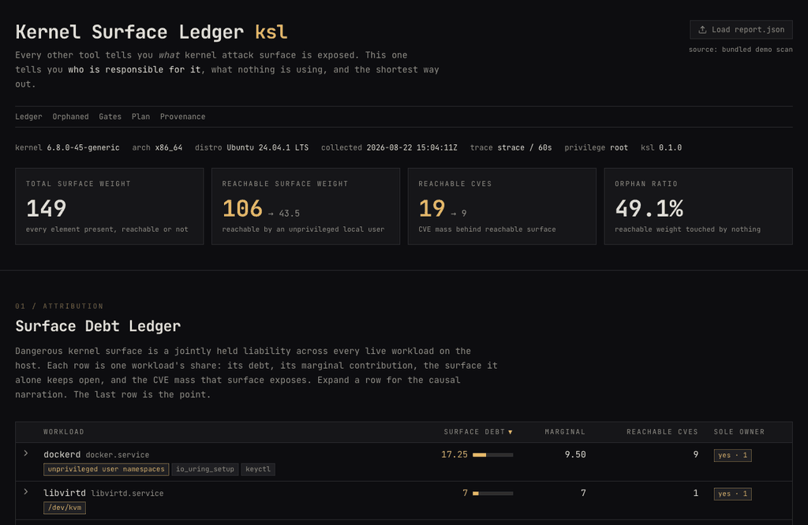

# Kernel Surface Ledger (`ksl`)

**Every existing tool tells you *what* kernel attack surface is exposed. None tell you *who* is responsible for it.**

`ksl` treats Linux kernel attack surface as an **accountability problem**. It builds a blame graph across every live workload on the host, attributes each dangerous piece of shared kernel surface to the process keeping it open, identifies surface that *nothing* touches, and computes the minimal set of changes that kills the most reachable CVE paths per unit of breakage risk.



```
SURFACE DEBT LEDGER                              debt   sole-owner   reachable CVEs
---------------------------------------------------------------------------------
dockerd        userns, io_uring, keyctl, autoload  21.0      yes             41
libvirtd       /dev/kvm, module autoload           10.8      yes             12
nginx          io_uring                             4.5       no              6
sshd           keyctl                               3.3       no              4
---------------------------------------------------------------------------------
ORPHANED       userfaultfd, perf_event_open,        58.0       -             23
               dccp, rds, tipc, n_hdlc,
               bluetooth, firewire, cramfs
               <- reachable by any local user, touched by NOTHING
```

That last row is the point. Fifty-eight weighted units of unprivileged-reachable kernel surface, on a normal server, that no running workload uses. Removing it is provably zero-impact - nothing touches it.

## Verified on a real host

The demo fixture is synthetic by design; the numbers below are not. They come from the scheduled CI scan of a **stock Ubuntu 24.04 GitHub Actions runner** (kernel 6.17.0-1022-azure) — committed to this repo as [`data/reports/report.json`](data/reports/report.json) and rendered at the [live dashboard](https://rajvardhanpatil07.github.io/kernel-surface-ledger/):

| Finding on the real host | Value |
| --- | --- |
| Reachable surface | 61.5 of 149 weighted units |
| Reachable CVE paths | **14 → 6** once the 5-step plan applies (8 killed) |
| Orphaned surface | 28.0 weighted units · 7 neutralizable CVEs |
| Notable orphans | `/dev/kvm` (mode 0660, usable by non-root), `tipc` + 4 legacy filesystem modules autoloadable, unprivileged user namespaces open |
| Top of the plan | seccomp `io_uring_setup` (3 CVEs, breakage: none), batched sysctl fragment (5 CVEs) |

Nothing on that machine was staged for the tool to find. Reproduce it anywhere: trigger the `collect` workflow from the Actions tab, or run `python ksl.py scan` on any Linux box and drop the resulting `report.json` onto the dashboard.

## How this differs from prior work

| Existing approach | Examples | What it misses |
| --- | --- | --- |
| Per-application policies | Confine, Chestnut, OCI seccomp hooks | one container whitelisted in isolation |
| Whole-kernel aggregate | kernel-hardening-checker, Kurmus et al. | ~180 unranked findings, nobody held responsible |
| Debloat-and-rebuild | Hacksaw, KASR, FACE-CHANGE | not a live host-assessment tool |

No prior tool attributes *shared* surface across concurrently running workloads, computes *host-wide* orphaned surface, or emits a *breakage-costed* counterfactual plan. That intersection is the contribution; the full survey with citations lives in [`docs/PRIOR_ART.md`](docs/PRIOR_ART.md).

## From one host to a fleet

Scaling out is a reduce, not a rearchitecture. `report.schema.json` is a frozen contract, so every host emits a self-contained, schema-valid document with no server-side state. Running the same read-only collector on 500 hosts (via SSH, a tiny agent, or a CI job — the scheduled `collect` workflow already is one) yields 500 comparable documents; aggregation is then a plain map-reduce: sum the weights, union the CVE sets, merge ledgers keyed by workload id. **That reduce is already written** — `scripts/fleet_rollup.py` takes N reports and emits the per-host table plus the fleet-wide orphaned-surface list ("orphaned on k/N hosts"). The properties that make single-host output trustworthy — determinism, sorted collections, byte-identical reruns over the same snapshot — are exactly the properties that make cross-host numbers well-defined and comparable. Fleet roll-up views are a rendering problem deliberately deferred, not missing architecture.

## The three contributions

1. **Attribution.** Prior work is either per-application (Confine, Chestnut, seccomp generators - one container, one whitelist) or whole-kernel aggregate (Kurmus, kernel-hardening-checker - one global score). Neither models the real situation: many concurrent workloads sharing one kernel, where surface is a *jointly held liability*. `ksl` computes per-workload marginal contribution over a bipartite blame graph.

2. **Orphaned surface.** Surface that is present, reachable by an unprivileged local user, and used by no live workload. Free hardening with zero functional risk.

3. **Counterfactual planning.** Hardening as weighted set cover: the *k* changes that neutralize maximum reachable CVE mass per unit of estimated breakage. Not 184 unranked findings - three ranked ones, each with a breakage prediction, a detection command, and a revert command.

## Reachability, not mere presence

A CVE in `dccp` is irrelevant if `dccp` cannot be loaded. A CVE in `io_uring` reachable by any local user is critical. Every element passes a three-tier gate:

| Tier | Question |
| --- | --- |
| `present` | Compiled in, loaded, or loadable via module autoload? |
| `reachable_unpriv` | Reachable by an unprivileged local user, given sysctl gates, LSM/lockdown state, and device node modes? |
| `used` | Actually invoked by any live workload during the observation window? |

Module autoload matters enormously here: it turns "not loaded" into "one `socket()` call away". Most audits miss this.

## Where the AI is - and is not

The scoring engine is fully deterministic. The LLM does three things it is genuinely better at than a rule table:

- **Causal narration** of each blame edge - why this workload needs this surface, what primitive an attacker gains, what the concrete alternative is.
- **Artifact synthesis** - real applicable files: `modprobe.d` blacklists, per-service seccomp-BPF JSON, systemd hardening drop-ins, sysctl fragments.
- **Breakage prediction** - what could break, how to detect it, how to revert it.

```bash
python ksl.py scan --raw fixtures/raw-demo.json --no-explain   # skips every LLM call
```

Produces **byte-identical scored output**. The AI explains and generates. It never decides. This is enforced by a test.

## Usage

```bash
# full pipeline on the live host (read-only; degrades gracefully as non-root)
python ksl.py scan -o report.json --save-raw raw.json

# offline demo: re-score the committed snapshot, no network, no API key
python ksl.py scan --raw fixtures/raw-demo.json -o report.json

# skip every LLM call - numeric output is byte-identical
python ksl.py scan --raw fixtures/raw-demo.json --no-explain

# validate any report against the frozen schema contract
python ksl.py check report.json
```

The static dashboard (`web/`) loads the latest runner-generated report, falls back to a bundled demo scan, and accepts any `report.json` via drag-and-drop.

## AI layer configuration

Any OpenAI-compatible chat endpoint works. Configuration comes from
environment variables or a gitignored `.env` (see `.env.example`):

```bash
cp .env.example .env   # then fill in your key
```

| Variable | Example |
| --- | --- |
| `KSL_API_BASE` | `https://openrouter.ai/api/v1` |
| `KSL_API_KEY` | your key (never committed) |
| `KSL_MODEL` | `nvidia/nemotron-3-super-120b-a12b:free` |

Every LLM response is cached to `explain/cache/<sha256(prompt)>.json`, and the
cache is committed. A demo run therefore needs **no network and no API key**: it
replays the exact narration in `docs/demo/report-explained.json`. On any error,
timeout, or missing key the pipeline silently keeps its deterministic template
content - numeric output is byte-identical either way.

## Tests

```bash
python -m unittest discover tests
```

Covers schema validity, byte-identical determinism, the LLM-independence invariant, reachability gates, attribution math, set-cover planning, and the CLI.

## Safety

The collector is **strictly read-only**. It never loads or unloads a module, never writes outside its output path, and degrades gracefully to a partial report when run as a non-root user. Hardening artifacts are *generated for review*, never auto-applied.

## Status

All five phases implemented: read-only collector (kconfig, modules with autoload, processes, sysctls, devnodes, three-backend syscall tracing), deterministic engine (reachability gates, blame-graph attribution, greedy set-cover planner), explain layer with disk-cached LLM narration and deterministic fallback, unified `ksl` CLI, and the static dashboard with scheduled runner scans deployed via GitHub Pages. See [`docs/TASKS.md`](docs/TASKS.md) for the plan and [`docs/PRIOR_ART.md`](docs/PRIOR_ART.md) for how this differs from existing work.

## Licensing note

This project is MIT licensed and shares no code with GPL tooling. `data/weights.yaml` is derived independently from the [KSPP recommended settings](https://kspp.github.io/Recommended_Settings), kernel documentation, and the [kernel.org CVE feed](https://git.kernel.org/pub/scm/linux/security/vulns.git). If you later choose to vendor check tables from [`kernel-hardening-checker`](https://github.com/a13xp0p0v/kernel-hardening-checker) (GPL-3.0) rather than shell out to it, this repository must be relicensed GPL-3.0.
